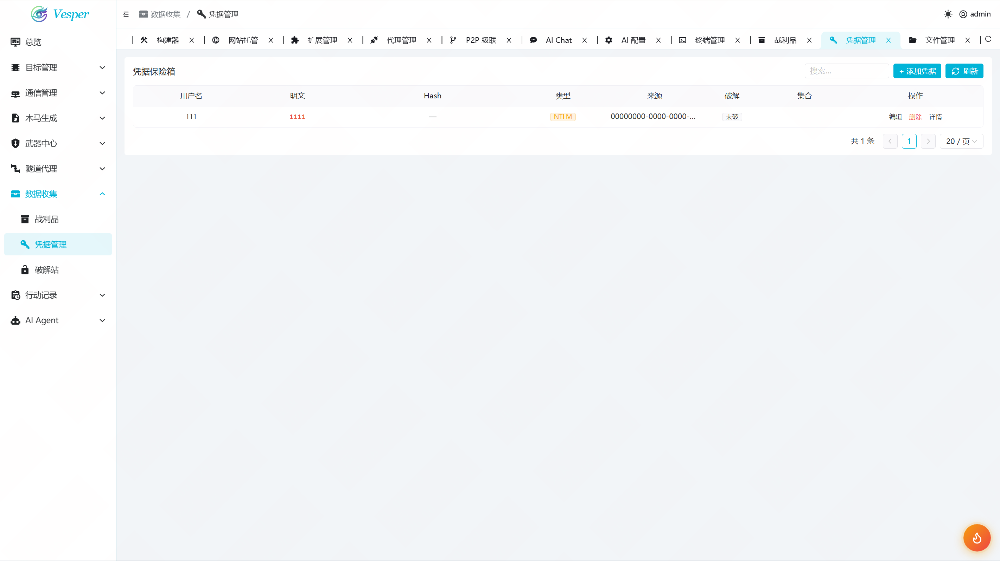
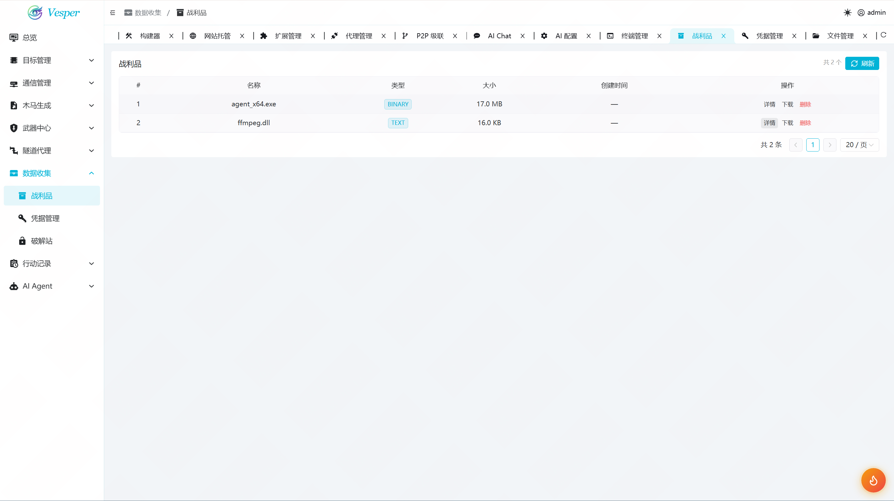

# Vesper C2 — Sliver Web 控制台

基于 Sliver C2 框架的 Web 管理面板，提供主机管理、载荷生成、交互终端、监听器配置等可视化操作。前端 Vue3 + NaiveUI，后端 Go Gin，通过 gRPC 连接 Sliver 守护进程。前后端一体编译为单二进制文件，支持 Linux / macOS / Windows，部署零外部依赖。

## 截图

| 登录 | 总览 |
|------|------|
|  |  |

| 主机管理 | 右键菜单 | 拓扑图 |
|---------|----------|--------|
|  |  |  |

| 交互终端 | 木马生成 |
|----------|----------|
|  |  |

| AI Agent | AI 辅助 |
|----------|---------|
|  |  |

| 凭据记录 | 战利品管理 |
|----------|-----------|
|  |  |

## 一键部署

```bash
curl -fsSL https://raw.githubusercontent.com/Qiu-Sec/Vesper-Releases/main/deploy.sh | bash
```

部署到**当前目录**，结构：

```
.
├── vesper              # Vesper 面板
├── sliver/             # Sliver 服务端
│   └── sliver-server_linux-amd64
└── .sliver/            # Sliver 数据
```

访问 `http://<IP>:8088`，登录 `admin / changeme`

Vesper 会自动启动，**Sliver 需要手动启动**（v1.7.3 有已知 gRPC 竞态 bug）：

```bash
cd .sliver && ../sliver/sliver-server_linux-amd64 daemon &
# 初始化 operator（仅首次）
../sliver/sliver-server_linux-amd64 operator --name admin1 --lhost 127.0.0.1 --permissions all \
    --save .sliver/configs/admin1_127.0.0.1.cfg
```

### Windows

> ⚠️ Windows 原生载荷生成可能失败（Go 版本兼容性），推荐用 Linux Vesper 交叉编译。

```cmd
start /B sliver\sliver-server_windows-amd64.exe daemon
sliver\sliver-server_windows-amd64.exe operator --name admin1 --lhost 127.0.0.1 --permissions all --save .sliver\configs\admin1_127.0.0.1.cfg
vesper-windows-amd64.exe --public 0.0.0.0:8088
```

### HTTPS（可选）

```bash
./vesper-linux-amd64 --public 0.0.0.0:443 --tls-cert cert.pem --tls-key key.pem
./vesper-linux-amd64 --domain c2.example.com               # Let's Encrypt
```

## 功能

| 页面 | 功能 |
|------|------|
| 仪表盘 | 统计卡片 + 快捷入口 + 会话图表 |
| 主机管理 | Beacon/Session 列表 + 右键工具菜单 |
| 交互终端 | xterm + beacon 命令 + 文件浏览器 |
| 监听器 | HTTP/HTTPS/MTLS/DNS/WG 启动/停止 |
| 木马生成 | 多格式 payload 配置 + C2 地址 + 构建记录 |
| AI Agent | 多模型对话 (DeepSeek/OpenAI/Anthropic) |
| 代理管理 | SOCKS5/HTTP 代理启停 |
| 凭据收集 | 自动提取 + 哈希破解记录 |
| 战利品 | 文件浏览 + 下载 |

## 编译

```bash
./build.sh              # 当前平台
./build.sh --all        # 交叉编译三平台 → release/
```

## 环境要求

**开发：** Go 1.21+ / Node.js 18+ / pnpm  
**生产：** 零额外依赖，单二进制运行

## 目录

```
Vesper/
├── deploy.sh            # 一键部署
├── build.sh             # 构建脚本
├── start.sh             # 开发启动
├── server/              # Go 后端
├── web/                 # Vue3 前端
├── sliver/              # Sliver Server 二进制（需自行下载）
└── docs/                # 文档 + 截图
```

## 文档

- [系统架构](docs/ARCHITECTURE.md)
- [生产部署指南](docs/DEPLOY.md)
- [功能使用指南](docs/USAGE.md)
- [常见问题](docs/FAQ.md)
- [Sliver v1.7.3 兼容性补丁](docs/sliver-v1.7.3-patches.md)

## 环境变量

所有配置通过环境变量设置，无需配置文件：

| 变量 | 默认值 | 说明 |
|------|--------|------|
| `VESPER_ADMIN_USER` | `admin` | 登录用户名 |
| `VESPER_ADMIN_PASS` | `changeme` | 登录密码 |
| `VESPER_AI_API_KEY` | （空） | AI API 密钥 |
| `VESPER_AI_ENDPOINT` | `https://api.deepseek.com/chat/completions` | AI 接口地址 |
| `VESPER_AI_MODEL` | `deepseek-v4-pro` | AI 模型名 |
| `VESPER_AI_TYPE` | `openai` | API 类型（openai / anthropic） |
| `VESPER_VERSION` | `dev` | 版本号（编译时 ldflags 注入，ENV 可覆盖） |

```bash
VESPER_ADMIN_PASS=MyP@ss VESPER_AI_API_KEY=sk-xxx ./vesper-linux-amd64 --public 0.0.0.0:8088
```

源码位置：`server/internal/config/config.go`

## 免责声明

**本工具仅供合法授权的安全测试和教育用途使用。**

- 使用者应确保已获得目标系统所有者的书面授权
- 未经授权访问计算机系统违反《刑法》第 285 条、第 286 条等法律规定
- 使用者需自行承担所有法律后果，作者不承担任何责任
- 禁止将本工具用于任何非法入侵、数据窃取、破坏系统等违法行为
- 下载、使用或分发本工具即表示您同意上述条款
- 如不同意，请立即删除所有相关文件
